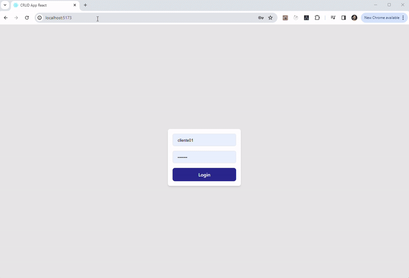

### Contexto

- Criação de aplicação CRUD Full Stack com base em tabelas com .ddl já definida

### Preview

### Requisitos, lista de funcionalidades e aspectos da aplicação

- Aplicação em configuração "monorepo"

### Back-end

Implementações/funcionalidades básicas
- [x] <b>API Rest que permita a realização das operações “CRUD” em todas as entidades;</b>
- [x] <b>API/backend em Node.js utilizando o framework Fastify;</b>
- [x] <b>SGBD de qualquer preferência aplicável; MySQL escolhido -> há plugin nativo Fastify</b>
- [x] <b>Controle de segurança: "rate limit" e jwt para acesso aos endpoints da API (Bearer token);</b>
- [x] Swagger implementado para acesso à documentação da API;
- [x] <b>Arquivo SQL contendo o DDL final e alguns “inserts” de dados de exemplo;</b>
- [x] <b>Coleção do Postman ou Insomnia, em formato JSON, para testes na API.</b>

> Login "Superuser" -> "username": "client01", "password": "senha01"

Adicionais
- [ ] Controllers (responsabilidade sobre requisição e resposta)
- [ ] Middlewares de erros e validações
- [ ] Services (regras de negócio)
- [ ] Models (responsabilidade somente sobre CRUD no banco de dados)
- [x] <b>Routes (organização de rotas)</b>
- [ ] Implementação de ORM (Sequelize,TypeORM, Prisma,...)
- [ ] TypeScript
- [ ] Docker
- [ ] Testes (unitários, integração)

> npm install && node ./back/src/index.js

### Front-end

Implementações/funcionalidades básicas
- [x] Frontend desenvolvido em React;
- [x] Front-end permite realizar todas as operações CRUD nas entidades existentes;

Adicionais
- [ ] Layouts e organização das telas, assim como o eventual uso de componentes/bibliotecas extras, ...
- [ ] Docker
- [ ] Testes (unitários, integração)
